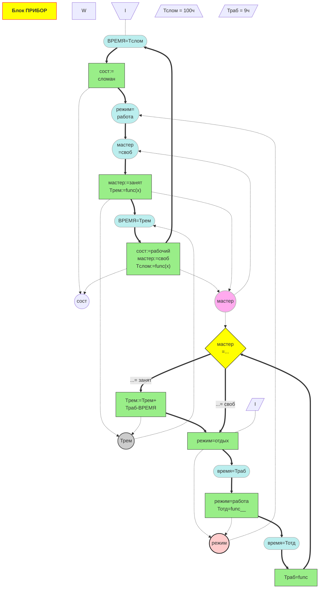

# Семинар 7

## Результат

## Код mermaid
flowchart TD
title[<b>Блок ПРИБОР</b>]
 %% задаем структуру первого процесса
 h1(["BPEMЯ=Tслом"]) ==> h2["сост:= сломан"];
 h2 ==> h3(["режим= работа"]);
 h3 ==> h4(["мастер =своб"]);
 h4 ==> h5["мастер:=занят Tрем:=funс(x)"];
 h5 ==> h6(["ВРЕМЯ=Трем"]);
 h6 ==> h7["сост:=рабочий мастер:=своб Tслом:=func(x)"];
 h7 ==> h1;

 %% задаем виды связей и параметры первого процесса
 h2 -.->par3((сост));
 h7 -.->par3((сост));
 par1((режим))-.->h3;
 par2((мастер))-.->h4;
 h7 -.->par2((мастер));W
 h5 -.->par2((мастер));
 h5 -.->par4((Трем));
 par4((Трем))-.-> h6;
 p0[\I/] -.- h1;
 h0[/"Тслом = 100ч"\];

 %% задаем структуру второго процесса
 h8["режим=отдых"] ==> h9(["время=Траб"]);
 h9 ==> h10["режим=работа Тотд=func__"];
 h10 ==> h11(["время=Тотд"]);
 h11 ==> h12["Траб=func"];
 h12 ==> h13{"мастер =..."};
 h13 ==>|"...= занят"| h14["Tрем:=Трем+ Траб-ВРЕМЯ"];
 h14 ==> h8;
 h13 ==>|"...= своб"| h8;

 %% задаем виды связей и параметры второго процесса
 h8 -.->par1;
 h10 -.->par1;
 par2 -.->h13;
 h14 -.->par4;
 p1[/I/] -.- h8;
 h15[/"Траб = 9ч"/];

 %% задаем раскраску
 classDef cond fill:#bee,stroke:#aaa,stroke-width:1px;
 classDef state fill:#9e8,stroke:#333,stroke-width:1px;
 classDef romb fill:yellow,stroke:black,stroke-width:1px;
 class h5,h2,h7,h8,h10,h12,h14 state;
 class h1,h3,h4,h6,h9,h11 cond;
 class h13 romb;
 style title fill:yellow,stroke:red;
 style par1 fill:#fcc,stroke:#111,stroke-width:2px;
 style par2 fill:#fae,stroke:#bbb,stroke-width:2px;
 style par4 fill:#ccc,stroke:#555,stroke-width:2px;
