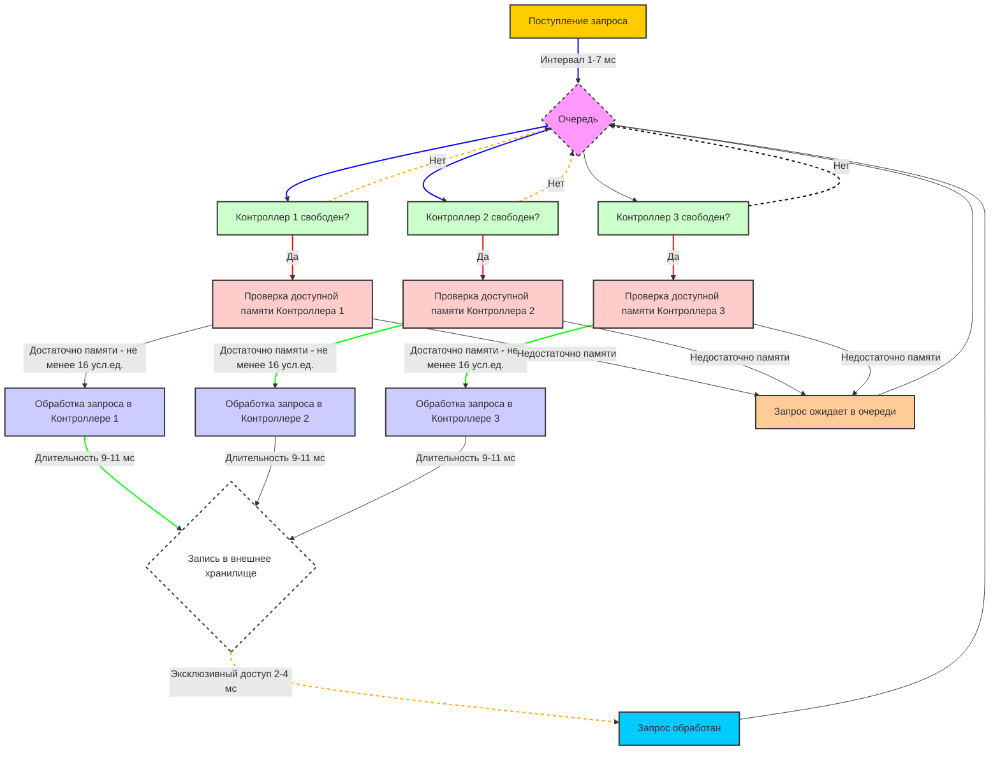

# РК-2, вариант 46

## Угрюмов Михаил, ИУ5-64Б

## Задание
Составить на ПОСП (ОПС, GPSS) алгоритм имитационной модели процесса функционирования следующей системы: К 3 контроллерам вычислительной системы из общей очереди поступают запросы с интервалом [1..7]мс, которые необходимо обрабатывать и передавать на запись в общее внешнее хранилище. Обработка запросов длится [9..11]мс и требует 16 или 32 усл.ед. оперативной памяти контроллера, которая освобождается после обработки. Запись во внешнее хранилище происходит в режиме эксклюзивного доступа и длится [2..4]мс. В каждом контроллере выделено 128 усл.ед. оперативной памяти для обработки данных. Смоделировать процесс обработки запросов. Оценить характеристики эффективности работы вычислительной системы. Закон распределения всех стохастических параметров равномерный.

### Написал код в mermaid:
```pseudo
graph TD
    A[Поступление запроса] -->|Интервал 1-7 мс| B{Очередь}
    B --> C[Контроллер 1 свободен?]
    B --> D[Контроллер 2 свободен?]
    B --> E[Контроллер 3 свободен?]
    
    C -->|Да| F[Проверка доступной памяти Контроллера 1]
    D -->|Да| G[Проверка доступной памяти Контроллера 2]
    E -->|Да| H[Проверка доступной памяти Контроллера 3]
    
    F -->|Достаточно памяти - не менее 16 усл.ед.| I[Обработка запроса в Контроллере 1]
    G -->|Достаточно памяти - не менее 16 усл.ед.| J[Обработка запроса в Контроллере 2]
    H -->|Достаточно памяти - не менее 16 усл.ед.| K[Обработка запроса в Контроллере 3]
    
    I -->|Длительность 9-11 мс| L{Запись в внешнее хранилище}
    J -->|Длительность 9-11 мс| L
    K -->|Длительность 9-11 мс| L
    
    L -->|Эксклюзивный доступ 2-4 мс| M[Запрос обработан]
    
    C -->|Нет| B
    D -->|Нет| B
    E -->|Нет| B

    F -->|Недостаточно памяти| N[Запрос ожидает в очереди]
    G -->|Недостаточно памяти| N
    H -->|Недостаточно памяти| N
    
    N --> B
    
    M --> B

    %% Стилизация узлов
    style A fill:#ffcc00,stroke:#333,stroke-width:2px
    style B fill:#f9f,stroke:#333,stroke-width:2px,stroke-dasharray: 5 5
    style C fill:#ccffcc,stroke:#333,stroke-width:2px
    style D fill:#ccffcc,stroke:#333,stroke-width:2px
    style E fill:#ccffcc,stroke:#333,stroke-width:2px
    style F fill:#ffcccc,stroke:#333,stroke-width:2px
    style G fill:#ffcccc,stroke:#333,stroke-width:2px
    style H fill:#ffcccc,stroke:#333,stroke-width:2px
    style I fill:#ccccff,stroke:#333,stroke-width:2px
    style J fill:#ccccff,stroke:#333,stroke-width:2px
    style K fill:#ccccff,stroke:#333,stroke-width:2px
    style L fill:#fff,stroke:#333,stroke-width:2px,stroke-dasharray: 5 5
    style M fill:#00ccff,stroke:#333,stroke-width:2px
    style N fill:#ffcc99,stroke:#333,stroke-width:2px

    %% Стилизация ребер
    linkStyle default stroke:#333,stroke-width:1px
    linkStyle 0,1,2 stroke:#0000ff,stroke-width:2px
    linkStyle 4,5,6 stroke:#ff0000,stroke-width:2px
    linkStyle 8,9,10 stroke:#00ff00,stroke-width:2px
    linkStyle 13,14,15 stroke:#ffa500,stroke-width:2px,stroke-dasharray: 5 5
    linkStyle 16 stroke:#000,stroke-width:2px,stroke-dasharray: 5 5
```

Получилась вот такая блок-схема:


### Написал псведокод:
```pseudo
# Константы
MEMORY_CONTROLLER = 128  # Условные единицы оперативной памяти в каждом контроллере
MEMORY_REQUEST_OPTIONS = [16, 32]  # Варианты памяти для запросов
INTERVAL_REQUEST_ARRIVAL = [1, 7]  # Интервал времени поступления запросов (в мс)
PROCESSING_TIME = [9, 11]  # Время обработки запросов (в мс)
STORAGE_TIME = [2, 4]  # Время записи во внешнее хранилище (в мс)
NUM_CONTROLLERS = 3  # Количество контроллеров

# Структуры данных
controllers = [
    { 'memory': MEMORY_CONTROLLER, 'queue': [] },
    { 'memory': MEMORY_CONTROLLER, 'queue': [] },
    { 'memory': MEMORY_CONTROLLER, 'queue': [] }
]
request_queue = []
storage_queue = []

# Функция для генерации равномерно распределенного случайного числа
function uniform_random(min, max):
    return random number between min and max

# Генерация запросов
function generate_requests():
    while True:
        wait uniform_random(INTERVAL_REQUEST_ARRIVAL[0], INTERVAL_REQUEST_ARRIVAL[1])
        memory_required = uniform_random(MEMORY_REQUEST_OPTIONS[0], MEMORY_REQUEST_OPTIONS[1])
        request_queue.append(memory_required)

# Обработка запросов контроллерами
function process_requests():
    while True:
        for controller in controllers:
            if request_queue is not empty:
                request = request_queue.pop(0)
                if controller['memory'] >= request:
                    controller['queue'].append(request)
                    controller['memory'] -= request
                    processing_time = uniform_random(PROCESSING_TIME[0], PROCESSING_TIME[1])
                    wait processing_time
                    controller['queue'].remove(request)
                    controller['memory'] += request
                    storage_queue.append(request)

# Запись во внешнее хранилище
function write_to_storage():
    while True:
        if storage_queue is not empty:
            request = storage_queue.pop(0)
            storage_time = uniform_random(STORAGE_TIME[0], STORAGE_TIME[1])
            wait storage_time

# Оценка эффективности работы системы
function evaluate_performance():
    # Здесь можно добавить код для оценки времени обработки, времени ожидания, уровня использования памяти и других характеристик.

# Основная функция
function main():
    start generate_requests in a separate thread
    start process_requests in a separate thread
    start write_to_storage in a separate thread
    start evaluate_performance in a separate thread

# Запуск модели
main()
```

### Описание псевдокода:

#### Константы и структуры данных:
Заданы константы для памяти контроллеров, памяти запросов, интервалов времени и числа контроллеров.
Созданы структуры данных для контроллеров и очередей запросов.

#### Функция uniform_random(min, max):
Генерирует случайное число в заданном интервале (для моделирования времени и размера памяти).

#### Функция generate_requests():
Периодически генерирует запросы с интервалами от 1 до 7 мс и добавляет их в очередь запросов.

#### Функция process_requests():
Контроллеры обрабатывают запросы из очереди запросов, проверяют доступную память, обрабатывают запросы и передают их в очередь на запись во внешнее хранилище.

#### Функция write_to_storage():
Записывает обработанные запросы во внешнее хранилище с эксклюзивным доступом.

#### Функция evaluate_performance():
Предназначена для оценки характеристик эффективности работы системы (например, времени обработки, времени ожидания, уровня использования памяти).

#### Основная функция main():
Запускает генерацию запросов, обработку запросов контроллерами и запись во внешнее хранилище в отдельных потоках.
Запуск модели начинается с вызова функции main().
